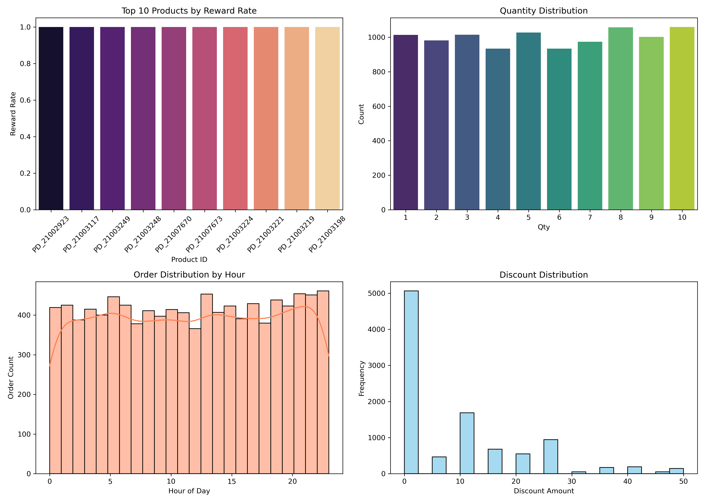

# Ajio_Data-Analysis
# 🛒 Ajio Retail Data Analysis — Exploratory Project

## 📌 Overview

This project presents an *end-to-end Exploratory Data Analysis (EDA)* on Ajio's transaction and customer order data to identify key business trends, customer behavior, product performance, and promotional effectiveness.

Ajio is one of India’s top fashion e-commerce platforms, and through this simulated/representative dataset, this project attempts to uncover strategic insights that could help Ajio's marketing, operations, and product teams make informed decisions.

---

## 🎯 Project Goals

- Analyze *customer behavior* across orders and transactions
- Understand *coupon and reward* program effectiveness
- Identify *top-performing products*
- Determine *preferred transaction modes*
- Discover *time-based shopping patterns*
- Combine multiple visuals into a *dashboard* for storytelling

---

## 📦 Dataset Description

The dataset is a *merged version* of multiple CSV files, assumed to represent:

| Column Name         | Description                                                  |
|---------------------|--------------------------------------------------------------|
| Or_ID             | Unique Order ID                                              |
| C_ID              | Unique Customer ID                                           |
| P_ID              | Product ID                                                   |
| Order_Date        | Date of order placement                                      |
| Order_Time        | Time of order placement                                      |
| Qty               | Quantity ordered                                             |
| Coupon            | Applied coupon code (if any)                                 |
| DP_ID             | Delivery partner ID                                          |
| Discount          | Discount applied (₹)                                         |
| Tr_ID             | Transaction ID                                               |
| Transaction_Mode  | Payment method used (UPI, Wallet, Card, etc.)               |
| Reward            | Reward points/cashback earned                                |
| Hour              | Extracted hour from Order_Time                             |
| Coupon_Used       | Binary flag: whether coupon was used                         |
| Reward_Flag       | Binary flag: whether reward was applied/earned               |

---

## 📈 Analysis Workflow

### 1️⃣ Data Cleaning & Transformation

- Combined multiple datasets into a unified structure using common keys.
- Parsed and standardized datetime columns.
- Created new derived features like Hour, Coupon_Used, Reward_Flag.

---

### 2️⃣ Exploratory Data Analysis (EDA)

#### ✅ *Coupon & Discount Usage*
- % of orders with coupons used
- Average discount applied with and without coupons
- Impact of discount on reward eligibility

#### ✅ *Reward Program Evaluation*
- Products with highest reward redemption
- Customers most likely to earn rewards
- Reward distribution across time slots and payment modes

#### ✅ *Product-Level Trends*
- Top 10 most ordered products
- Products contributing most to reward issuance
- Quantity patterns across product categories

#### ✅ *Time-of-Day Patterns*
- Orders by hour (0–23)
- Trends in reward/coupon usage by hour
- Identifying peak shopping times

#### ✅ *Transaction Mode Breakdown*
- Distribution of payment modes (e.g., UPI, Wallet, Card)
- Reward/coupon usage by payment type
- Insights into transaction preferences by time of day

---

### 3️⃣ Merged Dashboard

All key visuals were combined into one single *comprehensive dashboard* to represent:

- Reward rate by product
- Coupon usage patterns
- Hourly order distributions
- Transaction mode breakdown

📸 *Dashboard Preview*

---

## 🛠 Technologies Used

| Tool                | Purpose                                      |
|---------------------|----------------------------------------------|
| Python              | Core scripting language                      |
| Jupyter Notebook    | Analysis environment                         |
| Pandas              | Data wrangling and manipulation              |
| Seaborn & Matplotlib| Visualization libraries                      |
| NumPy               | Numerical computation                        |

---

## 💡 Key Insights

- *Evening (6–9 PM)* is the most active shopping period.
- *Coupon usage* strongly correlates with reward earning.
- *UPI and Wallet* dominate as preferred payment methods.
- A small group of products drives the majority of *rewards and discounts*.
- Customers respond better to *combined reward + discount offers* than to either alone.
